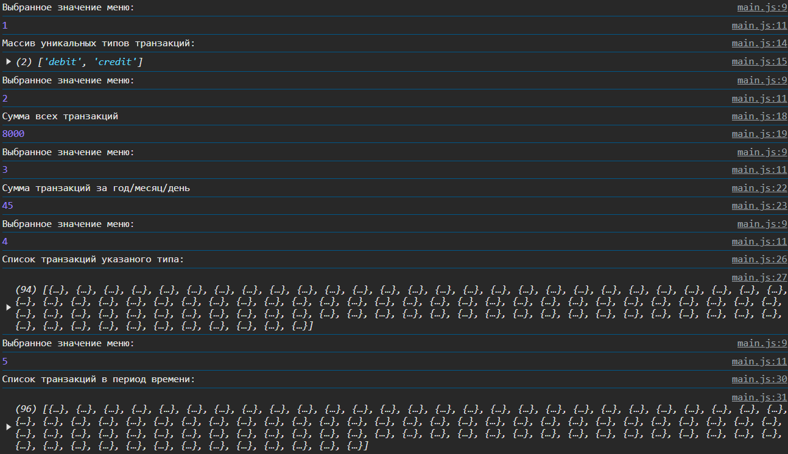
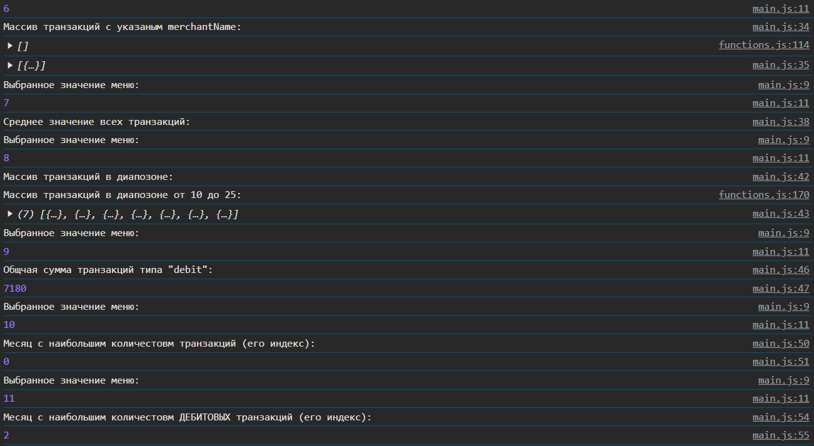
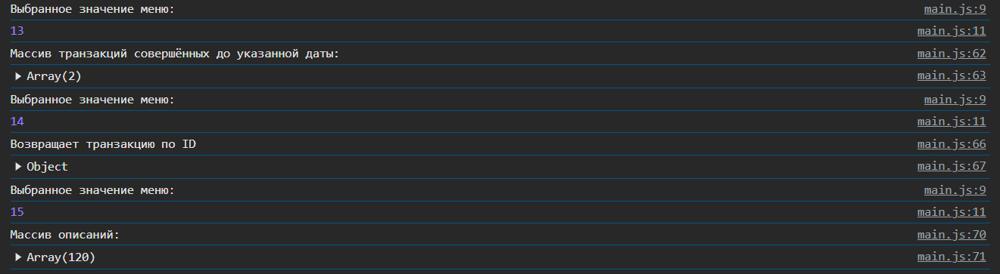
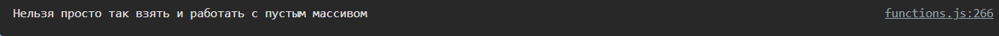
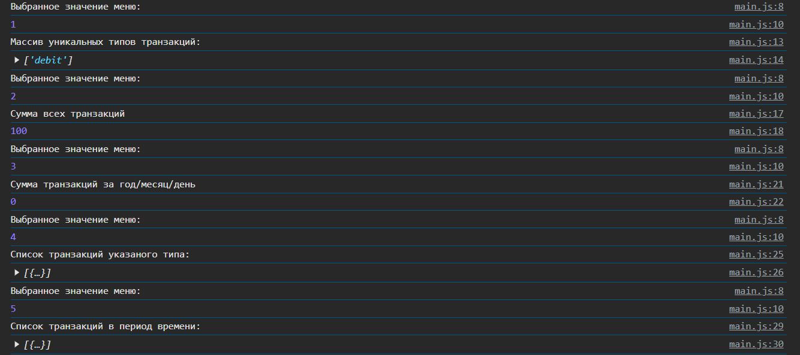
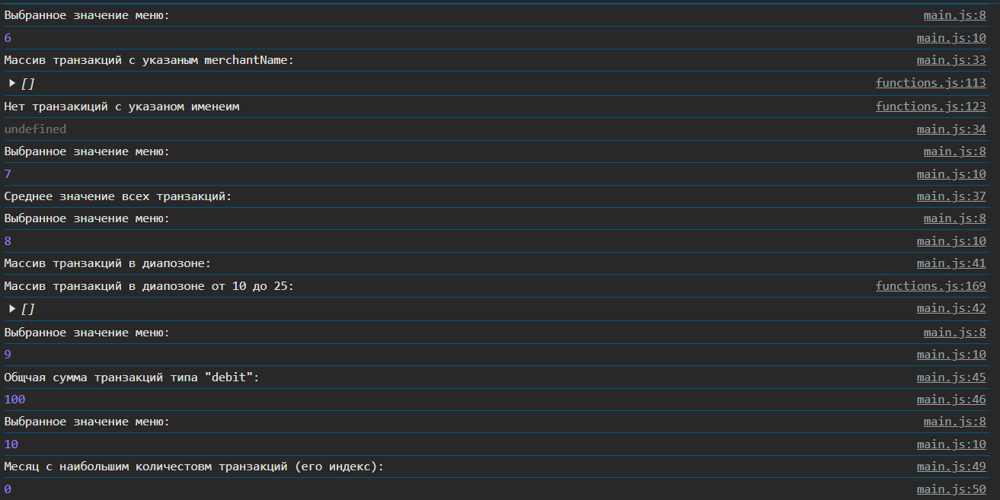
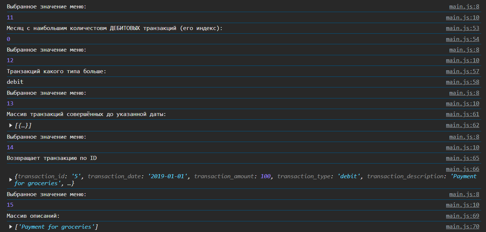
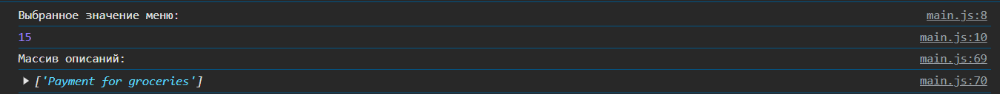

# Лабораторная №2 `Klincev Andrei IA2403`
## Запуск проекта
- Открытие файла `index.html`
- Открытия консоли браузера, чреез `F12` или `конекстное меню->код элемента`

## Цель лабораторной работы
Изучить основы работы с массивами и функциями в JavaScript, применяя их для обработки и анализа транзакций.

## Оглавление
- Выполнение заданий
  1. [Создание-массива-транзакций](#шаг-1-cоздание-массива-транзакций)
  2. [Реализация-функций-для-анализа-транзакций](#шаг-2-реализация-функций-для-анализа-транзакций)
  3. [Тестирование-функций](#шаг-3-тестирование-функций)
- [Контрольные вопросы](#контрольные-вопросы)
- [Список источников](#использованные-источники)

## Шаг 1. Создание массива транзакций

  - Создал файл main.js для размещения вашего кода.
  - Взял массив объектов с транзакциями. Каждая транзакция содержит следующие свойства:

    - transaction_id - уникальный идентификатор транзакции.
    - transaction_date - дата транзакции.
    - transaction_amount - сумма транзакции.
    - transaction_type - тип транзакции (приход или расход).
    - transaction_description - описание транзакции.
    - merchant_name - название магазина или сервиса.
    - card_type - тип карты (кредитная или дебетовая).

## Шаг 2. Реализация функций для анализа транзакций


### 1. `getUniqueTransactionTypes(transactions)`

  - Возвращает массив уникальных типов транзакций.
  - Используйте Set() для выполнения задания.

  ```javascript
    
  ```

### 2. `calculateTotalAmount(transactions)`  – Вычисляет сумму всех транзакций.

```JS
  /**
 * Возвращает массив уникальных типов транзакций
 * 
 * @param {trans} trans принимает массив транзакций 
 * @returns {trans} - типы транзакций  
 */
function getUniqueTransactionTypes(trans){
    //let unuqueTransTypesArr=new Set();
    
    //unuqueTransTypesArr.add(trans.filter(t => t.transaction_type => ));
    let outTrans=new Set();
    for (let i = 0; i < trans.length; i++){  
            outTrans.add(trans[i].transaction_type);
    }
    return Array.from(outTrans);
}
```

### 3. calculateTotalAmountByDate(transactions, year, month, day) [extra]

- Вычисляет общую сумму транзакций за указанный год, месяц и день.
- Параметры year, month и day являются необязательными.
- В случае отсутствия одного из параметров, метод производит расчет по остальным.

```JS
/**
 * Возвращает сумму транзакций за указанную дату
 * 
 * @param {trans} trans вводимый массив транзакций
 * @param {string} year год транзакций
 * @param {string} month месяц транзакции
 * @param {string} day день транзакции
 * @returns {number} возвращает сумму за указаннуые [trans, year, month, day]
 */
function calculateTotalAmountByDate(trans, year="", month="", day="")
{
        if (year !=""){
            const yearAmount = trans.filter(t => t.transaction_date.slice(0,4)==year);
            if (month !=""){
                const monthAmount = yearAmount.filter(t => t.transaction_date.slice(5,7)==month);
                if (day !=""){
                    const dayAmount = monthAmount.filter(t =>t.transaction_date.slice(8,10)==day);
                    return calculateTotalAmount(dayAmount);
                }
                return calculateTotalAmount(monthAmount);
            }
            return calculateTotalAmount(yearAmount);
        }
        return calculateTotalAmount(trans);
}
```

### 4. `getTransactionByType(transactions, type)` - Возвращает транзакции указанного типа (debit или credit)

```JS
/**
 * Возвращает транзакции указанного типа
 * 
 * @param {trans} trans вводимый массив транзакций
 * @param {string} type тип транзакции "debit" или "credit" 
 * @returns {Array} возвращает список трнзакций по параметру type
 */
function getTransactionByType(trans, type){
    let outTrans=[];
    for (let i = 0; i < trans.length; i++){

        if (trans[i].transaction_type === type){
            outTrans.push(trans[i]);
        }
    }
    return outTrans;
}
```

### 5. `getTransactionsInDateRange(transactions, startDate, endDate)` – Возвращает массив транзакций, проведенных в указанном диапазоне дат от startDate до endDate.

```JS
/**
 * Возвращает транзакции в указанном промежутке времени
 * 
 * @param {trans} trans вводимый массив транзакций
 * @param {string} startDate начальная дата в формате "0000-00-00"
 * @param {string} endDate конечная дата в формате "0000-00-00"
 * @returns {Array} возвращает массив трнзакци осуществлённые в период между startDate и endDate
 */
function getTransactionsInDateRange(trans, startDate, endDate){
    /*
    let outTrans=[];
    for (let i = 0; i < trans.length; i++){
        if (Date.parse(trans[i].transaction_date)>=Date.parse(startDate) && Date.parse(trans[i].transaction_date)<=Date.parse(endDate))
        {
            outTrans.push(trans[i]);
        }
    }
    */
    let outTrans = trans.filter(t => Date.parse(t.transaction_date)>=Date.parse(startDate) &&
                                    Date.parse(t.transaction_date)<=Date.parse(endDate));

    return outTrans;
}

```

### 6. `getTransactionsByMerchant(transactions, merchantName)` – Возвращает массив транзакций, совершенных с указанным merchantName.

```js
/**
 * Выводит массив транзакций с указанным merchantName
 * 
 * @param {trans} trans вводимый массив транзакций
 * @param {string} merchantName 
 * @returns {Array} возвращает массив транзакций с указанным merchantName
 */
function getTransactionsByMerchant(trans, merchantName){
    let outTrans=[];
    console.log(outTrans);
    for (let i = 0; i<trans.length; i++){
       if(trans[i].merchant_name == merchantName)
       {
        outTrans.push(trans[i]);
       }
    }
    
    if (outTrans.length==0)
    {
        console.log("Нет транзакиций с указаном именеим")
    }
    else{

        return outTrans;
    }
}
```

### 7. `calculateAverageTransactionAmount(transactions)` – Возвращает среднее значение транзакций.

```js
/**
 * Выводит среднюю цену всех транзакций
 * 
 * @param {trans} trans вводимый массив транзакций
 * @returns {number} среднее значение transaction_amount
 */
function calculateAverageTransactionAmount(trans){
    /*
    let sum=0;
    for (let i = 0; i<trans.length; i++)
    {
       sum += trans[i].transaction_amount;
    }
    console.log(`Средняя сумма всех транзакций: `)
    */
    return calculateTotalAmount(trans)/trans.length;
}
```

### 8. `getTransactionsByAmountRange(transactions, minAmount, maxAmount)` – Возвращает массив транзакций с суммой в заданном диапазоне от minAmount до maxAmount.

```js
/**
 * Возвращает транзакции в указанных пределах суммы
 * 
 * @param {trans} trans  вводимый массив транзакций
 * @param {number} startAmount начальнаый предел цены
 * @param {number} endAmount конечный предел цены
 * @returns {Array} возвращает массив трнзакци c ценой между startAmount и endAmount
 */
function getTransactionsByAmountRange(trans, startAmount, endAmount){
    /*
    let outTrans=[];
    for (let i = 0; i < trans.length; i++){
        if (trans[i].transaction_amount>=startSumm && trans[i].transaction_amount<=endSumm)
        {
            outTrans.push(trans[i]);
        }
    }
    */

    let outTrans=trans.filter(t => t.transaction_amount>=startAmount &&
                                    t.transaction_amount<=endAmount);
    console.log(`Массив транзакций в диапозоне от ${startAmount} до ${endAmount}: `);
    return outTrans;
}
```

### 9. `calculateTotalDebitAmount(transactions)` – Вычисляет общую сумму дебетовых транзакций.

```js
/**
 * 
 * @param {trans} trans вводимый массив транзакций 
 * @returns {number} возвращает сумму "debit" трнзакци
 */
function calculateTotalDebitAmount(trans){
    let outTrans= [];
    outTrans = getTransactionByType(trans,"debit");


    return calculateTotalAmount(outTrans);
}
```

### 10. `findMostTransactionsMonth(transactions)` – Возвращает месяц, в котором было больше всего транзакций.

```js
/**
 * Находит индекс месяца (0-январь, 11-декабрь), с наибольщим числом транзакций
 * 
 * @param {trans} trans вводимый массив транзакций 
 * @returns {number} возвращает идекс месяца с наибольшим числом транзакций
 */
function findMostTransactionsMonth(trans){
    let maxMonth= new Array(12).fill(0);
    for (let i = 0; i<trans.length; i++){
        const date = new Date(trans[i].transaction_date);
        maxMonth[date.getMonth()]+=1;
    };
    return maxMonth.indexOf(maxMonth.reduce((max, num) => (num > max ? num : max), maxMonth[0]));
}
```

### 11. `findMostDebitTransactionMonth(transactions)` – Возвращает месяц, в котором было больше дебетовых транзакций.

```js
/**
 * Находит индекс месяца (0-январь, 11-декабрь), с наибольщим числом "debit" транзакций
 * 
 * @param {trans} trans вводимый массив транзакций 
 * @returns {number} возвращает месяц с наибольшим числом дебитовых транзакций
 */
function findMostDebitTransactionMonth(trans){
    let outTrans=[];
    outTrans=getTransactionByType(trans,"debit");
    return findMostTransactionsMonth(outTrans);

}
```

### 12. `mostTransactionTypes(transactions)` -
- Возвращает каких транзакций больше всего.
- Возвращает debit, если дебетовых.
- Возвращает credit, если кредитовых.
- Возвращает equal, если количество равно.

```js
/**
 * Возвращает тип (название) транзакции, котрая чаще всего встречается
 * 
 * @param {trans} trans вводимый массив транзакций 
 * @returns {string} возвращает тип транзакции "debit", "credit","equal"
 */
function mostTransactionTypes(trans){
    const debList =getTransactionByType(trans, "debit");
    const credList =getTransactionByType(trans, "credit");
    if (debList>credList){
        return "debit";
    }
    else "credit";
    return "equal";
}
```

### 13. `getTransactionsBeforeDate(transactions, date)` – Возвращает массив транзакций, совершенных до указанной даты.

```js
/**
 * Выводит массив транзакций до указанной даты
 * 
 * @param {trans} trans вводимый массив транзакций 
 * @param {string} date дата придельной транзакции
 * @returns {trans} возвращает массив транзакций до указаной даты date
 */
function getTransactionsBeforeDate(trans, date){
    return getTransactionsInDateRange(trans, "0001-01-01", date)
}
```

### 14. `findTransactionById(transactions, id)` – Возвращает транзакцию по ее уникальному идентификатору (id).

```js
/**
 * 
 * @param {trans} trans вводимый массив транзакций 
 * @param {string} id уникальное значение транзакции
 * @returns {trans} возвращает транзакцию с указанным id
 */
function indTransactionById(trans, id){
    return trans.find(t =>t.transaction_id = id)
}
```

### 15. `mapTransactionDescriptions(transactions)` – Возвращает новый массив, содержащий только описания транзакций.

```js
/**
 * Выводит массив транзакций
 * 
 * @param {trans} trans вводимый массив транзакций 
 * @returns {Array} выводит масив из transaction_description каждой транзакции
 */
function mapTransactionDescriptions(trans){
    let outTrans =[]
    trans.forEach(element => {
        outTrans.push(element.transaction_description);
    });
    return outTrans;
}
```


## Шаг 3. Тестирование функций

1. Создайте массив транзакций и протестируйте все функции.
2. Выведите результаты в консоль.
    
    
3. Проверьте работу функций на различных наборах данных.
    
4. Проверьте работу функций на пустом массиве транзакций [extra].
   Для реализации проверки на пустой массив, был написана функция, которая проверяет если массив транзакций не пуст и которая вызывается внутри функции `holiMenu()`
   ```js
   function checkTransExist(trans){
        return trans.length>0 ? true :console.log(`Нельзя просто так взять и работать с пустым массивом`);
    }
   ```
  
1. Проверьте работу функций на массиве транзакций с одной транзакцией [extra].
    
  
  
  

Вызов программы происходит в фале `main.js`, он же и вызывается в `index.html`. Тут же и происходит вызов каждой функции через функцию `holiMenu`.

  ```js
  import transactions from "./transactions.js";
import {checkTransExist, 
        getUniqueTransactionTypes, 
        calculateTotalAmount, 
        calculateTotalAmountByDate, 
        getTransactionByType, 
        getTransactionsInDateRange, 
        getTransactionsByMerchant, 
        calculateAverageTransactionAmount, 
        getTransactionsByAmountRange, 
        calculateTotalDebitAmount, 
        findMostTransactionsMonth, 
        findMostDebitTransactionMonth, 
        mostTransactionTypes, 
        getTransactionsBeforeDate, 
        indTransactionById, 
        mapTransactionDescriptions} from "/sripts/functions.js";

function holiMenu(){
    let flag=true;
    if (checkTransExist(transactions)){  
        while (flag){
            console.log("Выбранное значение меню:");
            let chousedFunk = Number(prompt("Выберите функцию которую хотели бы обрабоать"));
            console.log(chousedFunk);
            switch (chousedFunk){
                case 1:
                    console.log(`Массив уникальных типов транзакций:`);
                    console.log(getUniqueTransactionTypes(transactions));
                    break;
                case 2:
                    console.log("Сумма всех транзакций");
                    console.log(calculateTotalAmount(transactions));
                    break;
                case 3:
                    console.log("Сумма транзакций за год/месяц/день");
                    console.log(calculateTotalAmountByDate(transactions, "2019", "01", "22"));
                    break;
                case 4:
                    console.log(`Список транзакций указаного типа:`);
                    console.log(getTransactionByType(transactions, "debit"));
                    break;
                case 5:
                    console.log(`Список транзакций в период времени: `);
                    console.log(getTransactionsInDateRange(transactions,"2019-01-01","2019-04-06"));
                    break;
                case 6:
                    console.log(`Массив транзакций с указаным merchantName: `);
                    console.log(getTransactionsByMerchant(transactions, "PizzaRestaurantXYZ"));
                    break;
                case 7:
                    console.log("Среднее значение всех транзакций:");
                    calculateAverageTransactionAmount(transactions)
                    break;
                case 8:
                    console.log(`Массив транзакций в диапозоне: `);
                    console.log(getTransactionsByAmountRange(transactions, 10, 25));
                    break;
                case 9:
                    console.log(`Общчая сумма транзакций типа "debit":`);
                    console.log(calculateTotalDebitAmount(transactions));
                    break;
                case 10:
                    console.log("Месяц с наибольшим количестовм транзакций (его индекс):");
                    console.log(findMostTransactionsMonth(transactions));
                    break;
                case 11:
                    console.log("Месяц с наибольшим количестовм ДЕБИТОВЫХ транзакций (его индекс):")
                    console.log(findMostDebitTransactionMonth(transactions));
                    break;
                case 12:
                    console.log("Транзакций какого типа больше: ");
                    console.log(mostTransactionTypes(transactions));
                    break;
                case 13:
                    console.log("Массив транзакций совершённых до указанной даты:")
                    console.log(getTransactionsBeforeDate(transactions, "2019-01-02"));
                    break;
                case 14:
                    console.log("Возвращает транзакцию по ID");
                    console.log(indTransactionById(transactions, "5"))
                    break;
                case 15:
                    console.log("Массив описаний:");
                    console.log(mapTransactionDescriptions(transactions))
                    break;
                default:
                    alert("Упси дупси, что-то пошло не так");
                    flag=!flag;
            }
        }
    }
}

holiMenu()
  ```

## Контрольные вопросы
  1. Какие методы массивов можно использовать для обработки объектов в JavaScript?
      #### Ответ: Можно использовать такие методы, как `map()`, `filter()` и `reduce()`. Передавая в них стрелочные выражения, можно либо провести действие над всем массивом, отобрать элементы по критерию или вычислить общее значение для всех элементов.
  2. Как сравнивать даты в строковом формате в JavaScript?
      #### Ответ: Если формат даты `YYYY-MM-DD`, то можно сравнивать их напрямую через операторы сравнени `>`, `<` и `===`. Если формат другой - парсить на отдельные числа, через `Date.parce()` обе даты и сравнивать.
  3. В чем разница между map(), filter() и reduce() при работе с массивами объектов?
        #### Ответ: `map()` изменяет каждый элемент массива, `filter()` отбирает элементы по условию, а `reduce()` объединяет элементы в одно значение.


## Использованные источники
- [MoodleUSM](https://moodle.usm.md/mod/page/view.php?id=300750)
- [Stack Overflow](https://ru.stackoverflow.com/questions/789389/Как-в-markdown-сделать-ссылку-для-перехода-к-заголовку)
- [GitHub](https://gist.github.com/asabaylus/3071099#start-of-content)
- [JavaScript.ru](https://learn.javascript.ru)
- [W3Shcools](https://www.w3schools.com/js/)